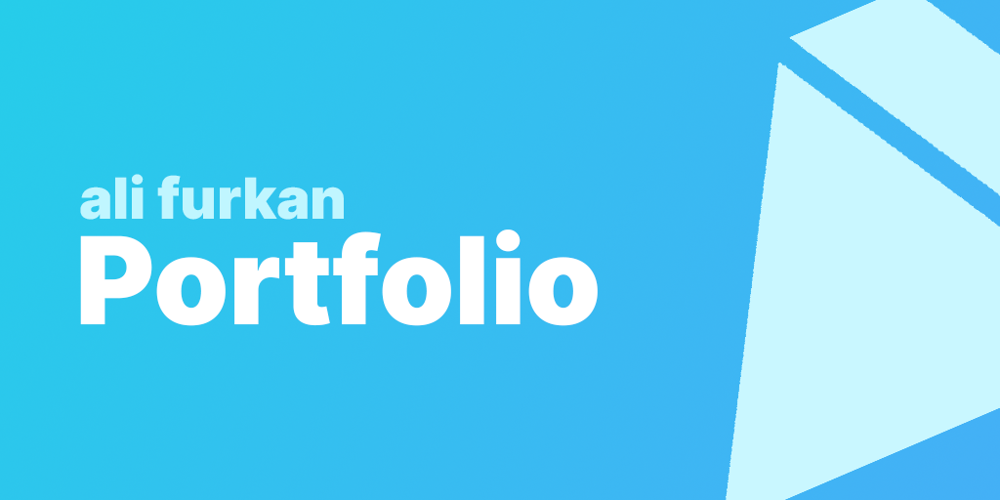
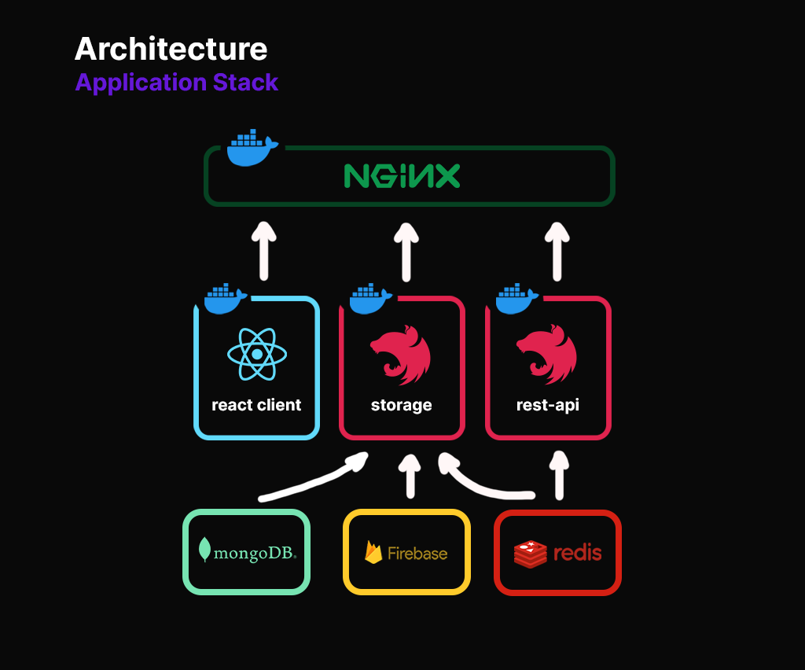

# Ali Furkan's Personal Website

This repository is source code of My Website that contains my services. You can use it as a template for your new project when make sure to edit the required parts. If you want to get more information or help me by contributing, you can continue reading this text.

## Architecture

This application covers the following services

- Front-end client ( React.js )
- Admin Dashboard ( with Front-end client )
- Storage Service ( Golang )
- Web Gateway ( NGINX )

## Requirements & Installation
I can't inform how does it because the first development hasn't completed yet

## To-Do

- [x] Do Storage Service
- [x] Do Front-end Portfolio
- [] Do Admin Dashboard

## License

This repository is [MIT licensed](./blob/master/LICENSE).
